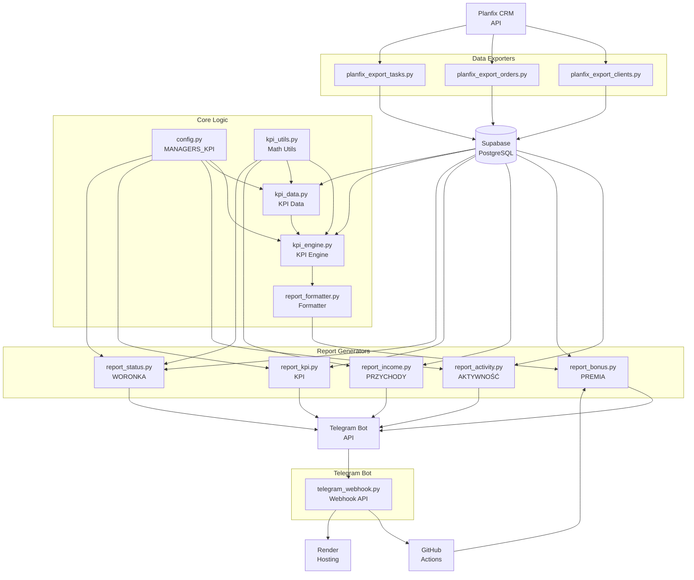

# Архитектура проекта Planfix KPI

## Обзор системы

Проект представляет собой систему автоматизации KPI отчетов для менеджеров, интегрированную с Planfix CRM и Telegram ботом.

## Основные компоненты

### 1. 📊 Core модули (scripts/core/)
**Центральная логика KPI расчетов**

- **`config.py`** - Конфигурация менеджеров (MANAGERS_KPI)
- **`kpi_engine.py`** - Централизованный движок KPI расчетов
- **`kpi_data.py`** - Получение и обработка KPI данных
- **`kpi_report.py`** - Формирование KPI отчетов
- **`kpi_utils.py`** - Вспомогательные функции (математическое округление)
- **`report_formatter.py`** - Универсальный форматтер отчетов

### 2. 🔄 Exporters (scripts/exporters/)
**Синхронизация данных из Planfix**

- **`planfix_export_clients.py`** - Экспорт клиентов
- **`planfix_export_orders.py`** - Экспорт заказов
- **`planfix_export_tasks.py`** - Экспорт задач

### 3. 📈 Reports (scripts/reports/)
**Генерация различных типов отчетов**

- **`report_activity.py`** - Отчет по активности (по часам)
- **`report_bonus.py`** - Отчет по премиям (PREMIA)
- **`report_income.py`** - Отчет по доходам (PRZYCHODY)
- **`report_kpi.py`** - Основной KPI отчет
- **`report_status.py`** - Отчет по статусам клиентов (WORONKA)

### 4. 🛠️ Utils (scripts/utils/)
**Вспомогательные утилиты**

- **`planfix_utils.py`** - Утилиты для работы с Planfix API и Supabase

### 5. 🤖 Telegram Bot (bot/)
**API для обработки команд бота**

- **`api/telegram_webhook.py`** - Webhook для команд `/premia_current`, `/premia_previous`
- **`wsgi.py`** - WSGI приложение для деплоя

## Архитектурная диаграмма



## Потоки данных

### 1. Синхронизация данных
```
Planfix API → Exporters → Supabase → Reports
```

### 2. Генерация отчетов
```
Supabase → Core Logic → Report Generators → Telegram
```

### 3. Команды бота
```
Telegram → Webhook → GitHub Actions → Report Generators → Telegram
```

## KPI показатели

### Клиенты (3 показателя)
- **NWI** - Nowi (новые клиенты)
- **WTR** - W trakcie (в работе)
- **PSK** - Perspektywiczni (перспективные)

### Задачи (11 показателей)
- **WDM** - Nawiązać pierwszy kontakt
- **PRZ** - Przeprowadzić pierwszą rozmowę telefoniczną
- **KZI** - Klient jest zainteresowany
- **ZKL** - Zadzwonić do klienta
- **SPT** - Przeprowadzić spotkanie
- **MAT** - Wysłać materiały
- **TPY** - Odpowiedzieć na pytanie techniczne
- **MSP** - Zapisać na media społecznościowe
- **NOW** - Opowiedzieć o nowościach
- **OPI** - Zebrać opinie
- **WRK** - Przywrócić klienta
- **KNT** - Tworzyć kontent
- **TTL** - Total (общий счетчик задач)

### Заказы (3 показателя)
- **OFW** - Отправленные предложения
- **ZAM** - Подтвержденные заказы
- **PRC** - Выручка (прибыль)

## Типы отчетов

### 1. Activity Report (AKTYWNOŚĆ)
- **Формат**: `AKTYWNOŚĆ_DD.MM.YYYY`
- **Периодичность**: Ежедневно в 19:00
- **Особенности**: Группировка по часам (9:00-16:59), показывает активные часы

### 2. KPI Report
- **Формат**: `KPI_DD.MM.YYYY` (дневной), `KPI_MM.YYYY` (месячный)
- **Периодичность**: Ежедневно в 19:00 (оба отчета)
- **Разделы**: Клиенты, Задачи, Заказы

### 3. Bonus Report (PREMIA)
- **Формат**: `PREMIA_MM.YYYY`
- **Периодичность**: Ежедневно в 19:00 + по команде бота
- **Команды**: `/premia_current`, `/premia_previous`
- **Расчет**: SUM → FND → PRK + PRW → TOT

### 4. Income Report (PRZYCHODY)
- **Формат**: `PRZYCHODY_MM.YYYY`
- **Периодичность**: Ежедневно в 19:00
- **Показатели**: Fakt (█), Dług (▒), Brak (░), Plan

### 5. Status Report (WORONKA)
- **Формат**: `WORONKA_DD.MM.YYYY`
- **Периодичность**: Ежедневно в 19:00
- **Статусы**: 9 статусов клиентов с динамикой ▲▼

## Конфигурация менеджеров

```python
MANAGERS_KPI = [
    {
        'planfix_user_name': 'Kozik Andrzej',
        'planfix_user_id': 945243
    },
    {
        'planfix_user_name': 'Stukalo Nazarii', 
        'planfix_user_id': 945245
    }
]
```

## Технологический стек

- **Backend**: Python 3.10+
- **Web Framework**: Flask
- **Database**: PostgreSQL (Supabase)
- **API Integration**: Planfix XML API, Telegram Bot API
- **Deployment**: Render
- **CI/CD**: GitHub Actions
- **Dependencies**: psycopg2, requests, python-dotenv

## Критически важные файлы

**НЕ УДАЛЯТЬ:**
- `scripts/core/` - вся папка с KPI логикой
- `scripts/core/config.py` - содержит MANAGERS_KPI
- `scripts/report_*.py` - генерация отчетов
- `scripts/planfix_export_*.py` - экспорт данных
- `scripts/planfix_utils.py` - утилиты
- `requirements.txt` - зависимости
- Все workflow файлы в `.github/workflows/`

## Особенности реализации

1. **Математическое округление** - используется во всех расчетах
2. **Ограничение KPI** - для большинства показателей применяется min(факт, план)
3. **Гибкие периоды** - поддержка дневных, месячных, квартальных отчетов
4. **История статусов** - для STL/NAK клиентов ведется история изменений
5. **Автоматизация** - все отчеты генерируются автоматически по расписанию
6. **Telegram интеграция** - команды бота для получения отчетов по премиям
